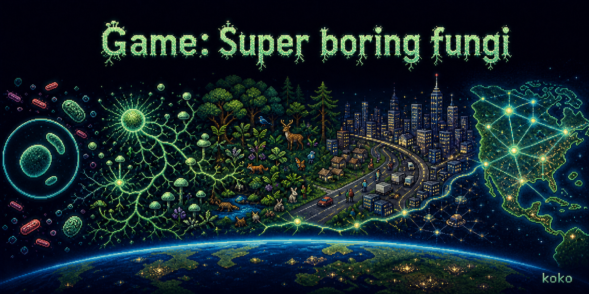

# Game: Super boring fungi

An idle evolution and expansion game about growing from a microscopic spore into a force capable of reshaping ecosystems, societies, nations, and eventually the planet.

The project is currently an early Windows prototype. Version `0.27.0` focuses on Chapter 1: a top-down laboratory microculture where the player controls only the fungus, grows a mycelial network, collects nutrients, evolves new abilities, and commands mobile expedition spores.

## Download and play

Open the repository's [latest Release](../../releases/latest), download the Windows ZIP, extract it, and double-click `FungiMicroculture.exe`.

- Platform: Windows 10/11, 64-bit
- Installation: none; the game data is embedded in the executable
- Save data: stored separately in the current Windows user's application-data directory
- Windows may show a SmartScreen warning because this hobby build is not code-signed

## Current playable features

- A large, zoomable laboratory culture with clustered organic nutrients, mineral ions, water motes, and stationary bacterial colonies.
- One spore core that grows primary hyphae and fine absorbing hyphae, with slow fractional nutrient uptake suitable for idle play.
- DNA production, reversible evolution choices, structure upgrades, survival upgrades, diet paths, and long-term goals with different rewards.
- Core biomass, toxin pressure, gradual recovery, dying orphaned hyphae, and network rescue by another living core.
- Barracks cores and several expedition-spore roles for gathering, transport, mineral collection, and bacteria-focused combat.
- Persistent fog of war on both the culture view and minimap, plus fast scout spores that automatically reveal hidden resource regions.
- Permanent anomaly discoveries, exploration notifications, expedition supply and suppression goals, and independent scout vision and movement upgrades.
- Telegraphing bacterial ecology events: contain a local bloom with predation or expedition spores, or survive a temporary toxin zone with antibiotics, detoxification, and repair reserves.
- A fog-hidden rival fungus that consumes real organic resources, slowly extends its own hyphae, and damages player cores after physical contact.
- Fungi-diet progression now unlocks piercer spores for attacking rival cores, plus a dedicated rival-colony objective and reward.
- Fungi-diet progression also unlocks coil hunters: order them onto individual enemy hyphae to sever supply lines, make dependent branches fade over 90 seconds, and earn the new severing objective while the rival regrows from its surviving network.
- A nine-step, non-blocking Chapter 1 guidance chain now connects core awakening, germination, absorption, DNA, colony growth, diet evolution, barracks, exploration, and rival clearance, ending in a persistent culture report.
- Fog-safe rival-hypha warnings appear only for explored threats; basic foragers retain a very slow manual anti-fungus fallback while fungi-specialist piercers remain dramatically stronger.
- A complete culture-session flow: true simulation pause, save-now and settings controls, save-and-return, separate continue/new-culture entries, overwrite confirmation, and recoverable game-over actions.
- Barracks production queues, per-barracks rally points, resource-aware automatic replenishment, and unit-type selection filters.
- Expedition spores now have role-specific fractional biomass, counterattack and toxin damage, automatic low-biomass retreat, slow free barracks repair, death, and replenishment.
- After the first rival is cleared, recurring Rival Sporefall cycles add long idle cooldowns, visible landing warnings, progressively stronger young colonies, and repeatable recovery rewards.
- RTS-style unit selection with a rectangular drag box, right-click orders, green command lines, accelerated testing speeds, and autosave.
- Up to two hours of resource-faithful offline progress; expedition combat is capped at ten minutes and toxin exposure at one minute, with offline replenishment and a detailed return report.
- Pixel-art splash screen, main menu, save loading, fullscreen/window settings, and an optional green pixel cursor.

## Controls

- Left click: inspect a core, choose actions, or select expedition spores
- Top unit filters: select all units or all units of one unlocked role
- Left drag: rectangular unit selection
- Right click: issue a movement, gathering, bacteria-attack, rival-core attack, or enemy-hypha severing order
- `R`: return selected expedition spores to their barracks
- Right drag / middle drag: move the camera
- Mouse wheel: zoom
- `WASD` / arrow keys: move the camera
- `E`: evolution shop
- `G`: long-term goals
- `F5`: save immediately
- `Esc`: close the current panel, cancel an action, or pause/resume

## Planned scale progression

The current microculture is only the opening scale. Future independent chapters are intended to move through microorganisms and cells, small organisms and objects, ecosystems, human society, cities, countries, and the modern Earth. Traits evolved at earlier scales are intended to influence later spreading and conquest strategies.

## Development

The project uses Godot `4.7` with GDScript. Open `project.godot` in Godot to run the source project. Automated smoke tests live in `tests/`; the Windows export preset embeds the PCK into one executable.

## Rights

Copyright © 2026 koko. All rights reserved.

The source code, visual assets, game design, text, and other repository contents are publicly viewable but are **not licensed for reuse, modification, redistribution, derivative works, or commercial use**. The official compiled release may only be downloaded and run for personal play and evaluation. See [LICENSE](LICENSE).

---

# 《超级无聊真菌游戏》

这是一款从微观孢子出发、逐步扩张至生态系统、人类社会、国家乃至整个地球的放置演化与征服游戏。

项目目前是 Windows 早期原型，版本为 `0.27.0`。现阶段集中制作第一章：玩家在俯视角实验室微观培养环境中只控制真菌，扩张菌丝网络、收集营养、进化能力，并指挥可离开母体活动的游猎孢子。

## 下载与运行

进入仓库的[最新 Release](../../releases/latest)，下载 Windows ZIP，解压后双击 `FungiMicroculture.exe` 即可运行。

- 平台：Windows 10/11 64 位
- 安装：无需安装，游戏数据已内嵌进 EXE
- 存档：单独保存在当前 Windows 用户的应用数据目录
- 因个人项目暂未进行代码签名，Windows 可能显示 SmartScreen 提示

## 当前可玩内容

- 可大范围缩放的实验室培养环境，包含聚集分布的有机营养、矿物离子、水分像素和静止细菌群落。
- 从一个孢子核心开始，延伸主菌丝并自动长出细吸收菌丝，以适合放置游戏的缓慢小数速率获取营养。
- DNA 生产、可逆进化、结构升级、生存升级、食性路线，以及奖励各不相同的长期目标。
- 核心生物量、毒素压力、缓慢恢复、孤立菌丝死亡，以及其他活核心重新连接后的网络救援。
- 兵营核心与多种游猎孢子，分别负责采集、运输、矿物收集和针对细菌的战斗。
- 可视化兵营生产队列、每座兵营独立集结点、遵守营养消耗的自动补员，以及按兵种快速筛选部队。
- 体外孢子现在具有按兵种区分的三位小数生物量、反击与毒素伤害、低生物量自动撤退、兵营缓慢免费修复、失活和自动补员闭环。
- 清除初始竞争菌落后会开启可重复的“竞争孢子雨”：经过长时间冷却和可定位的落点预警后生成逐轮增强的幼体菌落，击退后获得重复奖励。
- 大地图与小地图使用永久探索黑幕；高速嗅营孢子会自动寻找未探索区域并揭示资源热点。
- 异常资源区会触发永久发现记录与提示；新增远征补给、细菌压制目标，以及独立的嗅营感知和运动升级。
- 带预警的细菌生态事件：通过捕食和体外部队压制局部暴发，或利用抗生素、解毒代谢和修复储备熬过临时毒素区。
- 隐藏在探索黑幕后的竞争性真菌会消耗地图真实有机营养、缓慢延伸自己的菌丝，并在接触后侵染我方核心。
- 真菌食性现在可以解锁穿壁孢子，用于攻击竞争菌落核心，并配有独立长期目标与奖励。
- 真菌食性还可解锁“缠丝猎手”：把它右键指派到一段敌方菌丝后可切断供给线，使依赖该段的远端分支在90秒内逐渐暗淡、失活；竞争菌仍会从幸存网络重新生长，并新增“断丝战术”目标。
- 新增九步、非强制式第一章引导，将唤醒核心、萌发、吸收、DNA、扩建、食性、兵营、探索和清除竞争菌串成完整流程，结束后生成可持久保存的培养报告。
- 竞争菌丝威胁提示只读取已探索区域；基础游猎孢子保留极慢的手动对真菌攻击能力，真菌专属穿壁孢子仍具有显著效率优势。
- 完成培养会话管理闭环：真正冻结模拟的暂停菜单、立即保存与设置、保存返回主菜单、独立的继续/新培养入口、覆盖确认，以及失败后的重新培养和返回操作。
- 类 RTS 的矩形拖框选兵、右键指令和绿色命令线；另有测试加速与自动存档。
- 最多两小时、严格消耗地图真实资源的离线结算；体外单位战斗最多结算十分钟、毒素伤害最多一分钟，期间会执行自动补员，返回后显示详细报告。
- 像素风开屏、主菜单、读取存档、全屏/窗口设置和可关闭的绿色像素鼠标。

## 操作方式

- 左键：查看核心、选择操作或选中游猎孢子
- 顶部兵种筛选：选中全部单位或某一已解锁兵种
- 左键拖动：矩形框选部队
- 右键：下达移动、采集、攻击细菌、攻击竞争核心或切断敌方菌丝的命令
- `R`：让已选中的体外孢子返回所属兵营
- 右键拖动 / 中键拖动：移动镜头
- 鼠标滚轮：缩放
- `WASD` / 方向键：移动镜头
- `E`：进化商店
- `G`：长期目标
- `F5`：立即保存
- `Esc`：关闭当前面板、取消操作或暂停/继续

## 计划中的尺度阶段

当前微观培养只是游戏的起点。未来计划以独立章节依次扩展到微生物与细胞、小型生物与物品、生态系统、人类社会、城市、国家和现代地球。较小尺度进化出的生理特征将影响后续阶段的传播与征服策略。

## 开发

项目使用 Godot `4.7` 与 GDScript。使用 Godot 打开 `project.godot` 即可运行源码；自动化冒烟测试位于 `tests/`，Windows 导出设置会将 PCK 内嵌为单一 EXE。

## 权利声明

版权所有 © 2026 koko，保留所有权利。

本仓库的源码、视觉素材、游戏设计、文字及其他内容虽然公开可查看，但**不授权他人复用、修改、重新发布、制作衍生作品或用于商业用途**。官方编译版本仅允许下载后用于个人游玩与评估。详情见 [LICENSE](LICENSE)。
